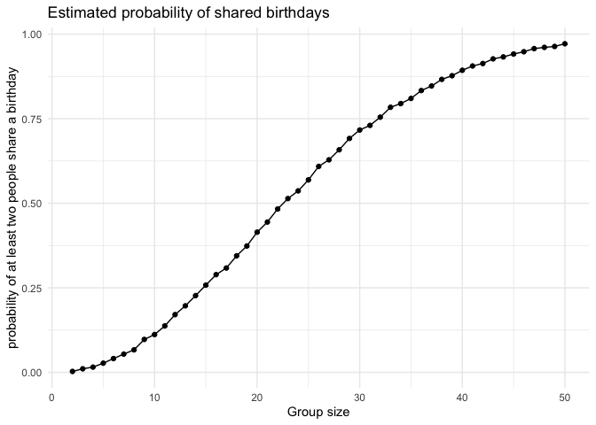
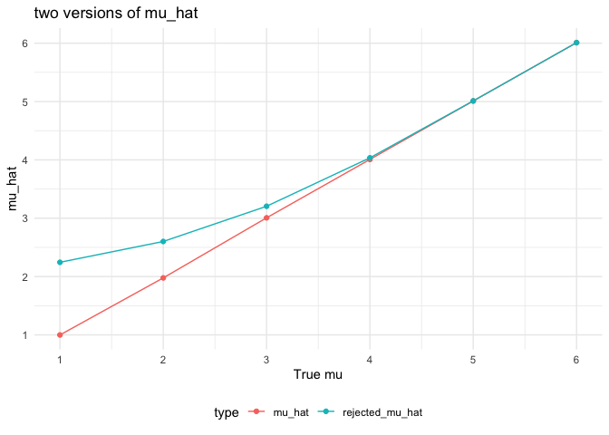
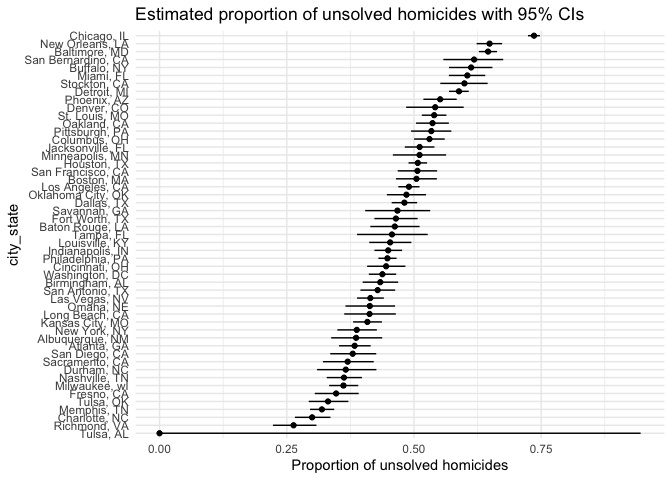

p8105_hw5_hc3671
================
Barry
2025-11-01

``` r
library(dplyr)
```

    ## 
    ## Attaching package: 'dplyr'

    ## The following objects are masked from 'package:stats':
    ## 
    ##     filter, lag

    ## The following objects are masked from 'package:base':
    ## 
    ##     intersect, setdiff, setequal, union

``` r
library(tidyverse)
```

    ## ── Attaching core tidyverse packages ──────────────────────── tidyverse 2.0.0 ──
    ## ✔ forcats   1.0.0     ✔ readr     2.1.5
    ## ✔ ggplot2   3.5.2     ✔ stringr   1.5.1
    ## ✔ lubridate 1.9.4     ✔ tibble    3.3.0
    ## ✔ purrr     1.1.0     ✔ tidyr     1.3.1

    ## ── Conflicts ────────────────────────────────────────── tidyverse_conflicts() ──
    ## ✖ dplyr::filter() masks stats::filter()
    ## ✖ dplyr::lag()    masks stats::lag()
    ## ℹ Use the conflicted package (<http://conflicted.r-lib.org/>) to force all conflicts to become errors

``` r
library(ggplot2)
set.seed(0416)
```

# Problem one

``` r
birthday_check = function(size){
  sample = sample(1:365, size, replace = TRUE)
  result = n_distinct(sample) < size
  result
}
birthday_simulation = 
  expand.grid(
    size = 2:50,
    iter = 1:10000
  ) |> 
  mutate(
    simulation = map(size, birthday_check)
  ) |> 
  unnest(cols = simulation) |> 
  group_by(size) |> 
  summarise(
    simulation_result = mean(simulation)
  )
birthday_plot = 
  birthday_simulation |> 
  ggplot(aes(x = size, y = simulation_result)) +
  geom_point() +
  geom_line() +
  labs(
    x = "Group size",
    y = "probability of at least two people share a birthday",
    title = "Estimated probability of shared birthdays",
  ) +
  theme_minimal()
birthday_plot
```

<!-- -->
When the group size reaches around 23, the probability of at least two
people share the same birthday is already 50% and keeps going up when
adding the group size.when the group size is over 45, the possibility is
pretty big that almost reach 1.

## Question2

``` r
n = 30
sigma = 5
mu = 0
iter = 5000
```

``` r
mu_simul = function(mu = 0){
  x = rnorm(n, mean = mu, sd = sigma)
  result = t.test(x, mu = 0)
  tibble(
    mu = mu,
    broom::tidy(result)[1:3]
  )
}
simulation_0 = 
  expand_grid(
    sample_mu = 0,
    iter = 1:5000
  ) |> 
  mutate(
    simulation = map(sample_mu, mu_simul)
  ) |> 
  unnest(simulation) 
simulation = 
  expand_grid(
    mu = 1:6,
    iter = 1:5000
  ) |> 
  mutate(
    simulation = map(mu, mu_simul)
  )
simulation_unnest = 
  simulation |> 
  select(sample_mu = mu, everything()) |> 
  unnest(simulation) 
```

Make the plots:

``` r
plot1 =
simulation_unnest |> 
  group_by(sample_mu) |> 
  summarise(
    power = sum(p.value < 0.05) / n()
  ) |> 
  ggplot(aes(x = sample_mu, y = power)) +
  geom_point() +
  geom_line() +
  scale_y_continuous(limits = c(0, 1)) +
  labs(
    title = "Power curve of one-sample t-test",
    x = "True mu",
    y = "Power"
  )
plot1
```

<!-- -->

Larger true effects are easier to detect, that means larger effect size
comes with larger power.

``` r
plot2 = 
  simulation_unnest |> 
  group_by(sample_mu) |> 
  summarise(
    mu_hat = mean(estimate),
    rejected_mu_hat = mean(estimate[p.value < 0.05])
  ) |> 
  pivot_longer(
    mu_hat:rejected_mu_hat,
    names_to = "type",
    values_to = "mu_esti"
  ) |> 
  ggplot(aes(x = sample_mu, y = mu_esti, colour = type)) +
  geom_line() +
  geom_point() +
  scale_x_continuous(breaks = seq(0, 6, by = 1)) +   
  scale_y_continuous(breaks = seq(0, 6, by = 1)) +  
  labs(
    title = "two versions of mu_hat",
    x = "True mu",y = "mu_hat"
  ) +
  theme_minimal() +
  theme(legend.position = "bottom")
plot2
```

<!-- -->

The sample average of $\hat{\mu}$ across tests for which the null is
rejected is approximately equal to the true value of $\mu$. between both
conditions, the sample mean should be the most precise prediction since
it is unbiased. When using the sample average of $\hat{\mu}$ across
tests for which the null is rejected, the result will be higher than the
true value $\mu$, because it rule out the small values. But when $\mu$
gets high the power becomes larger, it is more difficult to accept null
hypothesis, and the sample average of $\hat{\mu}$ across tests for which
the null is rejected will be closer to the true value, which obeys the
plot.

## Problem 3

``` r
homi_raw = 
  read_csv("homicide-data.csv") |> 
  janitor::clean_names() 
```

    ## Rows: 52179 Columns: 12
    ## ── Column specification ────────────────────────────────────────────────────────
    ## Delimiter: ","
    ## chr (9): uid, victim_last, victim_first, victim_race, victim_age, victim_sex...
    ## dbl (3): reported_date, lat, lon
    ## 
    ## ℹ Use `spec()` to retrieve the full column specification for this data.
    ## ℹ Specify the column types or set `show_col_types = FALSE` to quiet this message.

This data includes 12 variables and has 52179 cases from 28 states.
There are 52179. Key variables include: victim’ demographic
information’s age, race, sex, last name and the disposition.

``` r
homi_count = 
  homi_raw |> 
  mutate(
    city_state = str_c(city, ", ", state)
  ) |> 
  group_by(city_state) |> 
  summarise(
    number_homicides = n(),
    number_unsolved_homicides = sum(disposition %in% c("Closed without arrest", "Open/No arrest"))
  )
```

``` r
Baltimore_MD_test = 
homi_count |> 
  filter(city_state == "Baltimore, MD") |> 
  mutate(
    x = number_unsolved_homicides,
    n = number_homicides,
    prop = map2(x, n, prop.test),
    prop_tidy = map(prop, broom::tidy)
  ) |> 
  select(-prop) |> 
  unnest(prop_tidy)
```

``` r
test_all = 
  homi_count |> 
  mutate(
    x = number_unsolved_homicides,
    n = number_homicides,
    prop = map2(x, n, prop.test),
    prop_tidy = map(prop, broom::tidy)
  ) |> 
  select(-prop) |> 
  unnest(prop_tidy) |>
  select(city_state, number_unsolved_homicides, number_homicides, estimate,                  p.value, conf.low, conf.high)
```

    ## Warning: There was 1 warning in `mutate()`.
    ## ℹ In argument: `prop = map2(x, n, prop.test)`.
    ## Caused by warning in `.f()`:
    ## ! Chi-squared approximation may be incorrect

Make a plot:

``` r
city_homi_plot =
  test_all |>
  mutate(
    city_state = fct_reorder(city_state, estimate)
  ) |> 
  ggplot(aes(x = estimate, y = city_state)) +
  geom_point() +
  geom_errorbar(
    aes(xmin = conf.low, xmax = conf.high),
    width = 0
  ) +
  labs(
    x = "Proportion of unsolved homicides",
    title = "Estimated proportion of unsolved homicides with 95% CIs",
  ) +
  theme_minimal()

city_homi_plot
```

<!-- -->
